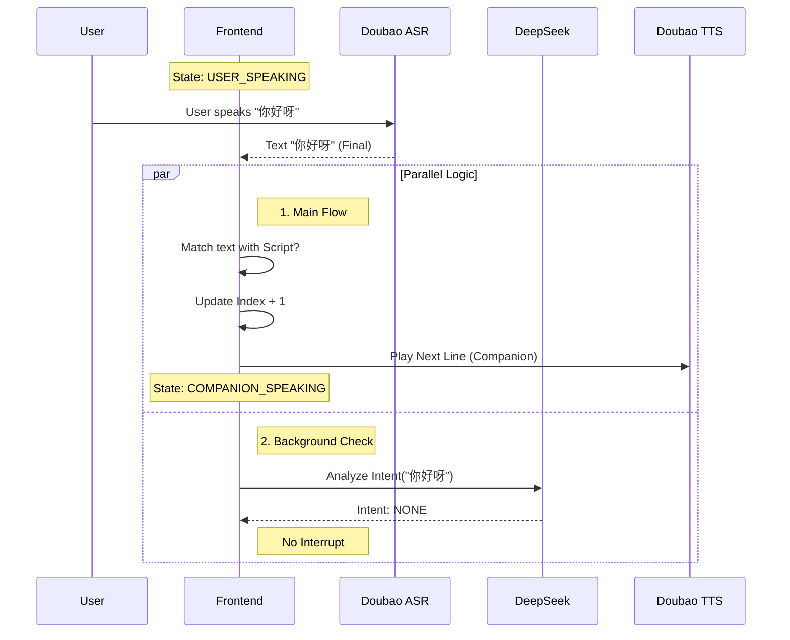
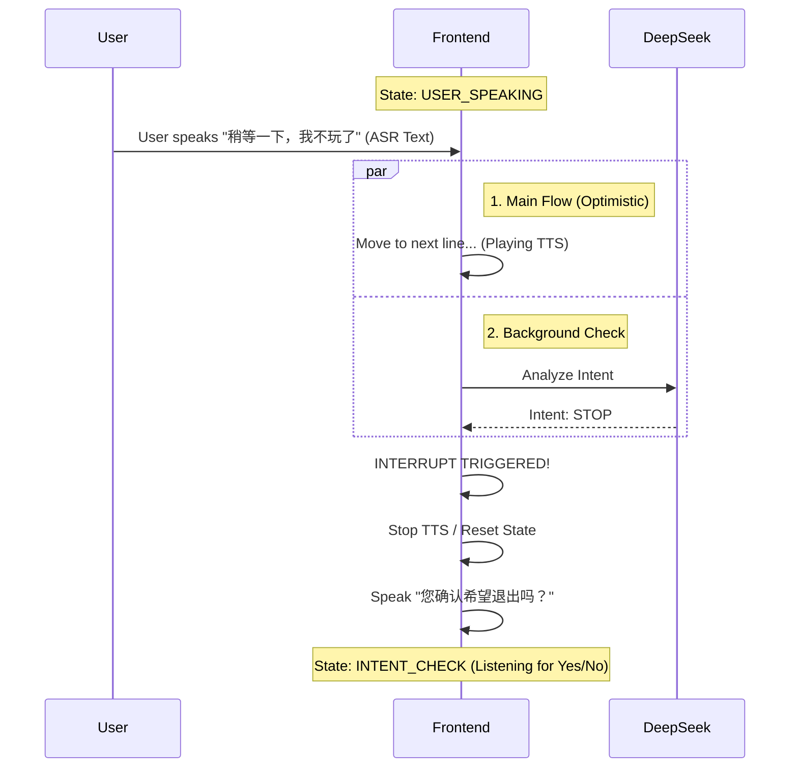

# ScriptBuddy Technical Design

## 1. 系统架构需求
*   **前端框架**: React (SPA)
*   **构建工具**: Vite (推荐) 或 CRA
*   **状态管理**: Zustand (推荐，适合管理复杂的语音/交互状态机)
*   **样式方案**: TailwindCSS (高效) 或 CSS Modules
*   **后端**: PHP 5.4 + MySQL 5.7 (提供 API 以及配置下发)
*   **AI 服务抽象层**:
    *   **IPerformer (演职服务)**: 负责听(ASR)和说(TTS)。(实现: 豆包/VolcEngine)
    *   **IReviewer (裁判服务)**: 负责意图判断和逻辑仲裁。(实现: DeepSeek)

## 2. 核心数据模型

### 2.1 剧本数据结构 (Script Data Model)

```typescript
type RoleKey = '甲' | '乙' | '合'; // 内部标识
// 允许用户自定义角色名称 (如 "甲" -> "刘涛")

interface ScriptLine {
  id: string;          // 唯一标识
  role: RoleKey;       // 角色 Key
  content: string;     // 台词内容
  // 扩展字段
  emotion?: string;    // 情感标签
  duration?: number;   // 预估时长
}

// 剧本对象
interface ScriptDoc {
  meta: {
    title: string;
    roleMap: Record<RoleKey, string>; // 角色显示名称映射，例如 { '甲': '康辉', '乙': '赵忠祥' }
    description: string;
  };
  lines: ScriptLine[]; 
}

// 运行时 角色分配
// userRole = '甲' (Key) -> App扮演 '乙'
```

### 2.2 全局状态机 (Global State Machine)

```typescript
type AppPhase = 
  | 'INIT'           // 启动，检查权限，拉取服务端配置
  | 'ROLE_SELECT'    // 询问用户角色
  | 'PRACTICE'       // 陪练对戏中
  | 'INTENT_CHECK'   // 中断判定
  | 'ERROR';

type PracticeState = 
  | 'IDLE'               // 等待
  | 'COMPANION_SPEAKING' // 陪练独白 (TTS ON, ASR OFF)
  | 'USER_SPEAKING'      // 用户独白 (ASR ON, TTS OFF)
  | 'TOGETHER_SPEAKING'  // 合念模式 (ASR ON, TTS OFF - 避免自听)
  | 'PROCESSING';        // 判定中

interface AppState {
  // Config
  userRole: RoleKey | null;
  masteryLevel: 1 | 2 | 3;
  serverConfig: {
    asrAppId: string;
    // Keys 不直接暴露在 State，闭包管理或隐藏
  } | null;
  
  // Script Progress
  currentLineIndex: number;
  script: ScriptDoc | null;

  // Runtime
  phase: AppPhase;
  practiceState: PracticeState;
  
  // Resources
  volumeLevel: number;
  permissionsGranted: boolean;
}
```

## 3. 模块设计 (业务抽象层)

### 3.1 演职人员服务 (IPerformer)
*业务接口，解耦具体厂商*。
**关键约束**：听(Listen)和说(Speak)互斥。不能同时进行，防止回音。

*   `listen(onResult)`: 开启耳朵。**调用前必须确保 stopSpeaking**。
*   `speak(text, options)`: 开启嘴巴。**调用前必须确保 stopListening**。
*   `stop()`: 停止一切（闭嘴+捂耳）。
*   `checkSystem()`: 检查系统状态。

### 3.2 裁判/仲裁服务 (IReviewer)
*   `judgeIntent(userText, context)`: 判断用户意图。

#### 核心交互逻辑 (Loop)
1.  **取下一句** (`script.lines[index]`)。
2.  **判断模式**：
    *   **如果是对方角色** -> `COMPANION_SPEAKING` -> `performer.stopListening()` -> `performer.speak()`。
    *   **如果是用户角色** -> `USER_SPEAKING` -> `performer.stopSpeaking()` -> `performer.listen()`。
    *   **如果是 '合'** -> `TOGETHER_SPEAKING` -> `performer.stopSpeaking()` (静音陪读) -> `performer.listen()`。
        *   *注*: 因互斥要求，合念模式下 App 不发声，由用户自己读，App 负责监听判定。
3.  **异步监听**：在 `USER/TOGETHER` 状态下，将文本送入 `reviewer.judgeIntent()`。

### 3.3 界面组件 (Components)
*   **StartupCheck**: 启动时调用 `GET /api/config` 获取配置，成功后检查权限。
*   **ScriptStage**:
    *   显示角色名称时，读取 `script.meta.roleMap[line.role]`。
*   **VoiceIndicator**: 明确区分状态。
    *   App说话时：显示波形/嘴巴动。
    *   App聆听时：显示耳朵/录音红点。
    *   **绝不**同时显示。

## 4. 关键交互时序图 (Simplified)
(略，逻辑同上，强调互斥)

## 5. API 接口定义

后端 (PHP) 负责分发配置和 Token。

### 5.1 获取配置
*   `GET /api/config.php`
*   Response:
    ```json
    {
      "asr": { "appId": "...", "token": "..." }, 
      "tts": { "appId": "...", "token": "..." },
      "llm": { "apiKey": "..." } // 或代理地址
    }
    ```
*   前端启动时请求此接口，存储在内存/Context中，不持久化到 LocalStorage。


### 3.3 界面组件 (Components)
*   **StartupCheck**: 权限检查页，大字提示。
*   **ScriptStage**: 台词展示区。
    *   `ScriptLineItem`: 单行台词组件，根据 `masteryLevel` 和 `role` 决定样式（黑/灰/白）。
    *   `AutoScroller`: 自动滚动逻辑。
*   **VoiceIndicator**: 底部语音区。
    *   `LottiePlayer`: 播放 说话/聆听 动画。

## 4. 关键交互时序图 (Simplified)

### 场景：用户对戏 (User Speaking) -> 陪练对戏 (Companion Speaking)


### 场景：用户触发中断 (User Interrupt)


## 5. API 接口定义 (Local Mock or PHP Proxy)

鉴于后端是 PHP 5.2，可能仅作为 Token 获取的代理。
*   `GET /api/token.php?service=asr`: 获取豆包 ASR Token。
*   `GET /api/token.php?service=tts`: 获取豆包 TTS Token。
*   (LLM Key 建议仅在开发测试期通过 .env 前端直接调用，生产环境应通过后端代理隐藏)

## 6. 目录结构规划
```
src/
  assets/          # Lottie JSONs, Images
  components/      # React Components
  hooks/           # Custom Hooks (useAudio, useScript)
  services/        # API, WebSocket wrappers
    asr.ts
    tts.ts
    llm.ts
  store/           # Zustand Store
  types/           # TypeScript Types
  utils/           # Helpers
  App.tsx
```
